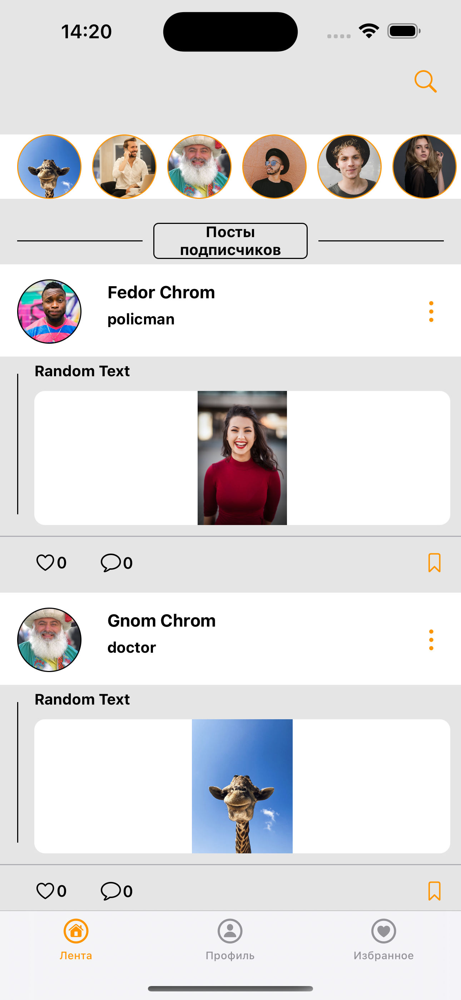

# SimpleSocNetwork

SimpleSocNetwork - это простая имитация социальной сети, построенная на UIKit и CoreData.

## Особенности:

1. **Профили:** пользователи могут создавать профили, указывая свои персональные данные. Создавать посты, фотогалерею и сторис. Доступен поиск профилей и постов. Можно подписываться и отписываться.

2. **Лента постов:** отображаются посты профилей на которые пользователь подписан и просмотр их сторис.

3. **Избранные:** отображение избранных постов пользователя с возможностью их удаления из списка.

      

4. **Настройки:**

- поддерживает локализацию русского и английского языка
- поддерживается светлая и темная тема

   

5. **Регистрация/Вход в Аккаунт:** происходит по номеру телефона. Система подтверждения реализована через имитацию СМС сообщений NotificationCenter.

    

